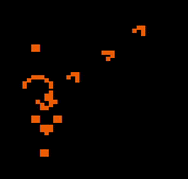

## Graphic Simulation of [Conway's Game of Life](https://en.wikipedia.org/wiki/Conway%27s_Game_of_Life)



<!--  -->

### For more details 
If you want to know in detail about the project. [Click here](https://docs.google.com/presentation/d/1sF14Q_KVdXcDS9ZJpw0ALw_CKbzqLNxW0uIKXhLR_64/edit?usp=sharing)


### Technology used
Source code is written in C++ with the OpenGL graphics library to simulate the game of life.


### How to execute?
```
g++ game-life.cpp -lGL -lGLU -lglut -lGLEW -o RP
```
```
./RP
```